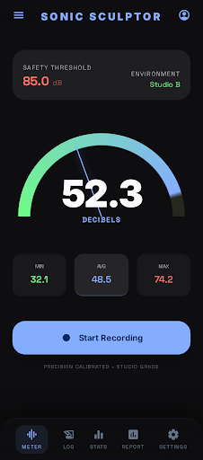
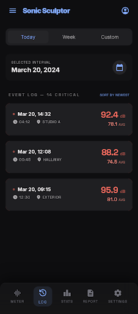
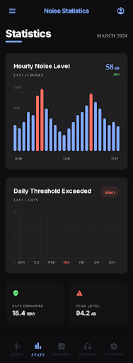
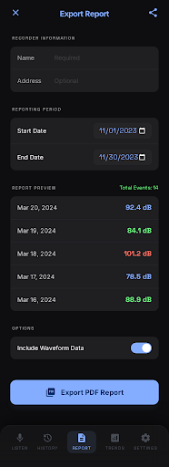

# Noise Recorder

騒音を計測・記録し、証拠として PDF レポートを出力できる iOS アプリ。

集合住宅の騒音問題など、継続的な記録が必要な場面での利用を想定している。

## スクリーンショット

<p align="center">
  
  
  
  
</p>

> デザインモック画像。実際の UI とは一部異なる。

## 機能

- リアルタイム騒音メーター（ゲージ表示、min / avg / max 統計）
- 閾値超過の自動検知とログ記録
- マイクキャリブレーション（ノイズフロア自動補正）
- 統計ダッシュボード（時間帯別・日別チャート）
- PDF レポート出力（期間指定、共有機能）

## ノイズフロア補正

AVAudioRecorder の `averagePower()` は dBFS（-160〜0）を返す。iPhone マイクのノイズフロアが約 -60 dBFS あるため、単純なオフセット変換では静かな環境でも 60 dB と表示されてしまう。

このアプリでは初回計測時にノイズフロアを自動測定し、以下の式で補正する:

```
normalizedDb = max(0, (power - noiseFloor) + 30)
```

- `noiseFloor`: キャリブレーション時に測定した dBFS 平均値
- `30`: 静寂環境の近似 SPL（定数）

これにより、静かな環境では約 30 dB、会話レベルで約 60 dB と妥当な値が表示される。

## 技術スタック

| 項目 | 技術 |
|------|------|
| 言語 | Swift 6 |
| UI | SwiftUI |
| データ | SwiftData |
| 音声入力 | AVAudioRecorder |
| チャート | Swift Charts |
| レポート | PDFKit |
| 最小 OS | iOS 17.0 |

## ビルド

```bash
# Xcode 16 以上が必要
open NoiseRecorder.xcodeproj
```

Xcode でターゲットデバイスを選択し、Run（Cmd+R）でビルド・実行。

## 注意事項

- 表示される dB 値は近似値であり、専門的な測定機器の代替にはならない
- マイク使用権限（`NSMicrophoneUsageDescription`）が必要

## 開発計画

[docs/PLAN.md](docs/PLAN.md) を参照。

## ライセンス

MIT
